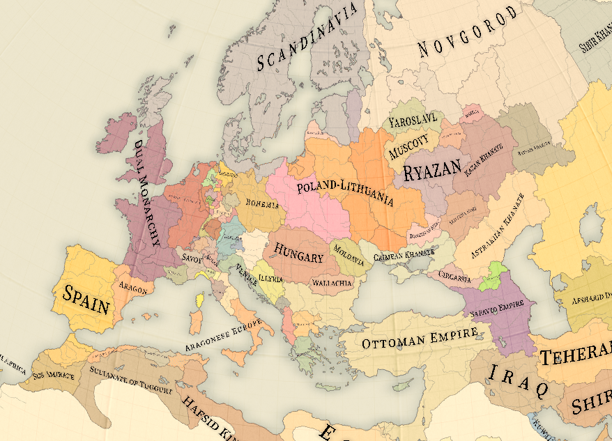

# DoD-MP

Multiplayer version of DoD rework.

## How to play?

Since the game is heavily rebalanced, forget what you learnt from vanilla - it's going to be harmful:

### Nation roster

As a starting nation, I'd recommend Japan, it scales, and provides some leeway for errors and mistakes, while not being too punishing in the early game. You don't also have to involve yourself in wars if you don't want to, and the most you could lose is your colonies.

- Dual Monarchy: A strong nation on the surface, but with various underlying issues interally, Dual Monarchy has their Bohemian ally as their key protector against the Burgundian threat, they might however, decide to ally to Burgundy to counter the rise of a hegemonous HRE. Whatever they choose, they need to keep the two monarchies together, somehow.
- Burgundy: Sandwhiched between a naval power and a military power, Burgundy made a name for itself by being a military powerhouse, being able to defeat countless of duchies and kingdoms, and keeping the Dual Monarchy and Bohemia at bay, alongside their Scandinavian ally, but the loss of any part of their industrial powerhouse will mark trouble and permanently cripple them.
- Scandinavia: A nation that achieved naval dominance by securing key alliances on Europe, now being threatened by the rise of Russia and Bohemia, their faithful ally, Burgundy, keeps the check on Bohemia, but perhaps allying with Bohemia, whilst being a radical decision, might save the union, and it's declining population
- Bohemia: Marked by a crown in the gutter, their dreams of reforming the HRE are only shattered by reality, they need to redo their armies and management in order to be able to stand glorious again, and being a proper state.
- Poland-Lithuanian Commonwealth: A declining nation, thankfully Prussia got neutralized by the Bohemian conquest of Brandenburg, but that doesn't mean PLC is safe from threats, the rising Russian menace is crippling them, alongside with the contest for Crimea and their petty disputes with Bohemia, they need to get rid of the old nobility and be able to become a functional state.
- Muscovy and Novgorod: Two nations, two potential candidates to reform the Russian empire, the one who loses gets annexxed and the one who wins becomes the true emperor of the Rus. But both have to face against Scandinavian and Polish pressure.
- Ottoman Empire: A nation ravaged by rebellions and instability, the reformist government being backstabbed by it's own elite, leading to the severe crippling of the nation.
- Aragon: The ambitious mediterrean powerhouse will lead to Italian reformation, or would it seek to reunite Iberia? Either of which they choose they need to contend against Dual Monarchy and/or Spanish pressure.
- Spain: Losing a colony is bad, but losing both is worse, as Spain their main objective lies on recovering their Colonies and reuniting Iberia. But an alliance with Aragon may come fruitful, whoever can get control of Navarre might have a chance at reuniting Iberia for good, much to the dismay of the Dual Monarchy.
- Japan: A nation with ambitions but lack of resources, Japan has to defend themselves against colonial threats, especially by European powers who view them as "just another uncivilized nation", securing key alliances is essential for their survival, and holding onto their colonies to be able to reap from the resources of China and Korea.
- Gran Colombia: A former Spanish colony, now independent, what will the future hold for them if they can't even get their northern territories to integrate? Certainly not a bright one, maybe might not collapse instantly if they had just done better!
- Plantagenia: A potential contender for Arcadian hegemony, having to face against the explosive Gran Colombia and the Scandinavian-backed Vinland, having to wait until Scandinavia falls out of grace.

### Do's and don't's!

- **DO NOT** tax 100% or tariff 100%, you will face the consequences if you have a weak economy (rebels mainly)
- **DO NOT** max spend on education and admin, unless you can afford to
- **DO NOT** declare war without checking alliance blocs first
- **DO NOT** spam units of "lower quality" to win - regiments are more of "quality" over "quantity" (for unit types), do not spam mobilized units or you will lose a considerable amount of your pops!
- **DO NOT** go to war without a strong economy and some reserve cash
- **DO NOT** spam building industries, you will go bankrupt immeadiately
- **DO NOT** spend money in events, or you will go bankrupt if you can't afford it
- **DO NOT** get into debt if you don't know how to use it - otherwise you'll go bankrupt
- **DO NOT** go over the infamy limit
- **DO** conquer other countries if you're an unciv
- **DO** use automatic alliances (checkbox right next to influence priority) to have a way to levy against other nations (otherwise they will perceive you as weak, and attack you)
- **DO** use domestic slider as high as you can if you're laissez faire
- **DO** get strong allies if you're a secondary power, especially great powers
- **DO** colonize africa IF you can afford it (war is costly!)

### Extra notes when playing
- AI will always **try to** go for the "most sensical lore-wise" path unless there is player intervention
- Africa severely lacks flavour, so if you want more Africa flavour *just ask for it*
- Substates gameplay boils down to civilizing, and either becoming independent or submitting (instant game over)

## Changes

- War exhaustion has been reduced considerably, but it can start to add up if you are at war for a long period of time (+3 years)
- Casualties now are extremely devastating for your POPs, so you should take care of your armies
- Made national focuses even more powerful, especially party loyalty ones
- Generals and Admirals are now considerably rarer, and die faster; they however amass more prestige
- You're able to mobilize way more if you're jingoist or pro-military
- Same with Armors with Infantry
- Regiments minimum size is 1,000 instead of 3,000
- Understaffed regiments, basically you don't magically spawn soldiers, the number of soldiers on the brigades actually correspond 1:1 to a POP
- Wartime soldier promotion increased
- Less conservative UH changes when doing reforms
